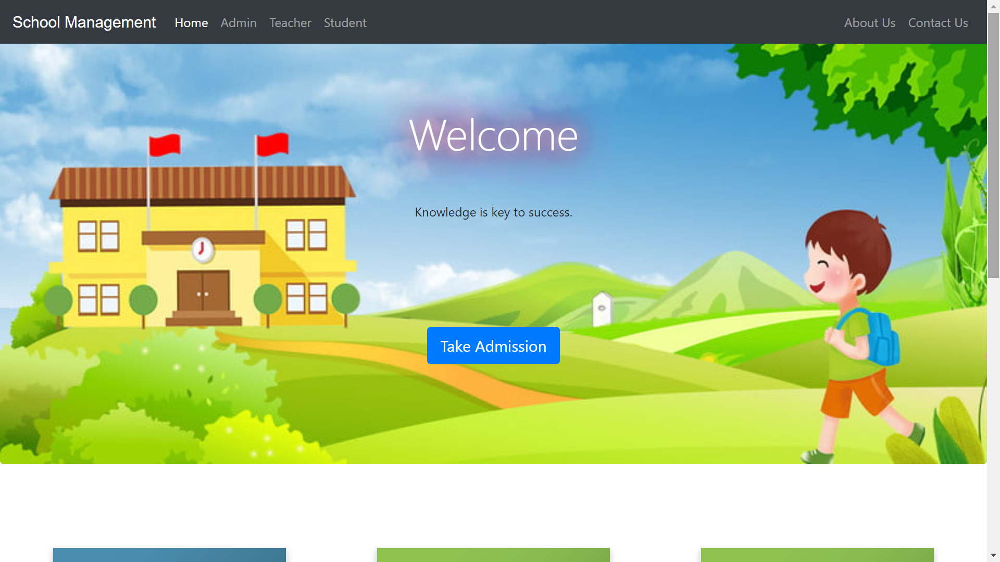
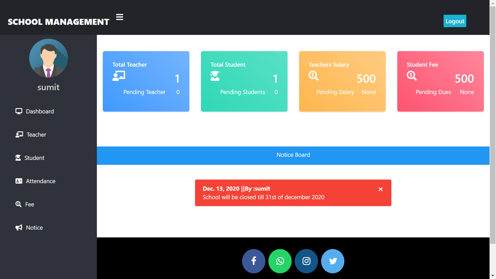
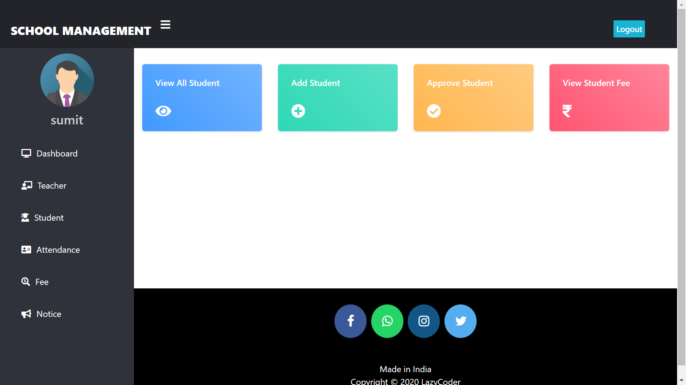
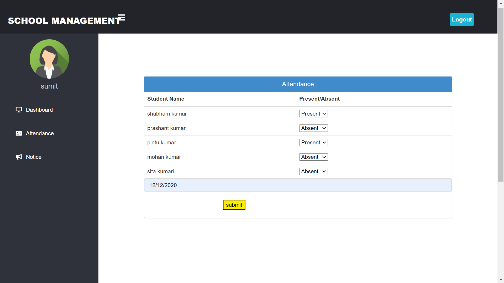

<!-- Markdown -->
<!-- # heading one
## heading two
### heading three
#### heading four -->


<!-- ## Project Name
project description here
## Text format
**Text is bold**

*Italic text here*

~~Delete text~~

## List
- one
- two
- three
    - other
    -other
---
1. one
2. two
3. three
4. four
    1. other
    2. other

---


## table

| id | name | age | phone  |
|----|------|-----|--------|
| 01 | 02   | 03  | 05     |
| 02 | Rady | 000 | 898    |

## Block quote
> npm install

> composer install

>pip install


## Code online

`print("hello world")`

`npm install express`

## Code multiple line

```html
<h1>hello world </h1>
<p> this is a para </p>
```
```python
for i in range(10):
    print(i)
```
```css
nav{
    display:flex;
    justify-content:center;
}
```


## Check list

- [x] Home page
- [x] about page
- [] contact page
- [] service page


## Link 

CSS framework [Tailwindcss](https://tailwindcss.com/)

Video framework[Travel](https://youtu.be/tsxfQOcoXLA?si=FuDtI5lhX4dwykRz)

## Image dashboard


## Badge

[![Button]](https://img.shields.io/badge/Visit-Website-blue) -->


<!-- ________________practice__ -->


## School Management

[](https://tailwindcss.com/)

### Sreenshort

---

**Home page**



**Admin Dashboard**



**Admin Manage Teacher**



**Attendance**



**Teacher Dashboard**


---

### Functions
---

**Teacher**

First the teacher will apply for job,if he/she gets selected there accounts will be made and approved by the admin, after approval only teacher can access their dashboard. After account approval by admin, teacher can take attendance of any class and view their attendance later. Teacher can also publish/announce notice to student like submission of assignments.

**Student**
---
First student will take admission/signup. When their account is approved by admin, only then the student can access their dashboard. After account approval by admin the student can view their details like attendance. Student can't view attendance of other student. Student can't announce, they can only view.

**Admin**

First admin will signup for a account. After login they can see how many student/teacher wants to get job/admission in their school. They can approve or delete/cancel the request. They can update any student/teacher details. Admin can announce notice also.

**Drawbacks**
---
- On update page of teacher/student you must have to update password.
- Anyone can become Admin

### HOW TO RUN THIS PROJECT

- Install Python(3.7.6) (Dont Forget to Tick Add to Path while installing Python)
- Install Python(3.7.6) (Dont Forget to Tick Add to Path while installing Python)

`python -m pip install -r requirements.txt`

- Download This Project Zip Folder and Extract it
- Move to project folder in Terminal. Then run following Commands :

```python
py manage.py makemigrations
py manage.py migrate
py manage.py runserver
```
- Now enter following URL in Your Browser Installed On Your Pc

```python
http://127.0.0.1:8000/
```

### CHANGES REQUIRED FOR CONTACT US PAGE
----
- In settins.py file, You have to give your email and password

```python
EMAIL_HOST_USER = 'youremail@gmail.com'
EMAIL_HOST_PASSWORD = 'your email password'
EMAIL_RECEIVING_USER = 'youremail@gmail.com'
```
- Login to gmail through host email id in your browser and open following link and turn it ON

```python
https://myaccount.google.com/lesssecureapps
```
### Disclaimer
---
This project is developed for demo purpose and it's not supposed to be used in real application.

### Feedback
---
Any suggestion and feedback is welcome. You can message me on facebook

- [Contact on Facebook](https://web.facebook.com/sumit.luv?_rdc=1&_rdr#)
- [Subscribe my Channel LazyCoder On Youtube](https://www.youtube.com/watch?v=1VaoDZpzWTw&ab_channel=EnglishwithLucy)